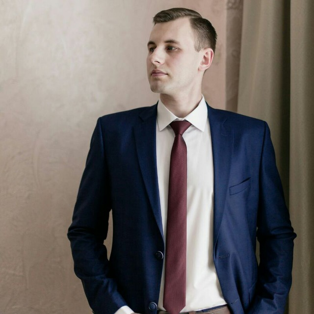

# My portfolio

## Here is my photo:

## There will be some text about me

**Hello!** My name is _Bogdan_, I'm 32 years old, and I'm **very** interested in studying the course "QA engineer from beginning to middle" on Netology.ru

But _nevertheless_ it's not the end of my studying path. I want to learn who is the **DevOps** engineer, what is his knowledge, skills and what kind of work does he do. After _this_ course I plan to study for _that_ specialty.

**So wish me a good luck!**

remote_theme: pages-themes/tactile@v0.2.0
plugins:
- jekyll-remote-theme # add this line to the plugins list if you already have one
